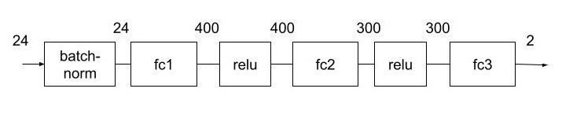
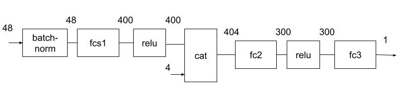
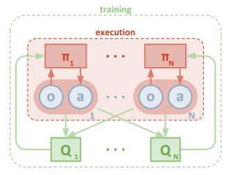

# Report

This notebook is the project summary report for the third project submission 'Callibration & Competition' for the Udacity Ud893 Deep Reinforcement Learning Nanodegree (DRLND). As such it includes a decription of the implementation, learning algorithm(s), hyperparameters, neural net model architectures, reward/episode plots and ideas for future work.

## Implementation

### Goal and Environment

This project uses the [Tennis environment](https://github.com/Unity-Technologies/ml-agents/blob/main/docs/Learning-Environment-Examples.md#tennis).


In this environment, two agents control rackets to bounce a ball over a net. If an agent hits the ball over the net, it receives a reward of +0.1. If an agent lets a ball hit the ground or hits the ball out of bounds, it receives a reward of -0.01. Thus, the goal of each agent is to keep the ball in play.

The observation space consists of 24 variables corresponding to the position and velocity of the ball and racket, etc. Each agent receives its own, local observation. Two continuous actions are available, one for each agent, corresponding to movement toward (or away from) the net, and jumping.

### Environment Solution

The task is episodic, and in order to solve the environment, your agents must get an average score of +0.5 (over 100 consecutive episodes, after taking the maximum over both agents). Specifically,

- After each episode, we add up the rewards that each agent received (without discounting), to get a score for each agent. This yields 2 (potentially different) scores. We then take the maximum of these 2 scores.

- This yields a single score for each episode.

The environment is considered solved, when the average (over 100 episodes) of those scores is at least +0.5.

### Files

The following provides a list of the key files and directories in the main project directory and their function.

| <p align="left">Filename</p>              | <p align="left">Function</p>                                   |
| :---------------------------------------- | :------------------------------------------------------------- |
| <p align="left">README.md</p>             | <p align="left">Main readme</p>                                |
| <p align="left">Report.md</p>             | <p align="left">Report readme markdown</p>                     |
| <p align="left">P3.ipynb</p>              | <p align="left">Main training loop python notebook</p>         |
| <p align="left">maddpg_agent.py</p>       | <p align="left">MADDPG agent python file</p>                   |
| <p align="left">ddpg_agent.py</p>         | <p align="left">Original DDPG reference agent python file </p> |
| <p align="left">model.py</p>              | <p align="left">Python Pytorch neural network file</p>         |
| <p align="left">/model_dir/\*.pt</p>      | <p align="left">Saved Pytorch model files</p>                  |
| <p align="left">Tennis_Windows_x86_64</p> | <p align="left">Tennis Unity environment directory</p>         |
| <p align="left">/python</p>               | <p align="left">Additional dependencies directory</p>          |

### Adaption

An approach adapting and combining the code from both the DDPG implementation of the Actor-Critic Methods lesson (where a DDPG implementation was applied to the OpenAI Gym Pendulum-v0 environment) and the MADDPG implementation of the Introduction to MARL lesson (where a MADDPG implemention was applied to a simple adversary environment) is employed as the basis for implementing the agent algorithms to solve the Tennis environment in this submission. The following papers - [Continuous Control with Deep RL](https://arxiv.org/pdf/1509.02971.pdf), [Multi-Agent Actor-Critic For Mixed Cooperative-Competitive Environments](https://papers.nips.cc/paper/2017/file/68a9750337a418a86fe06c1991a1d64c-Paper.pdf) are also used as a resource for the adaption and implementation details.

The main training loop function `ddpg`, from the DDPG implementation of the Actor-Critic Methods lesson, renamed as `training_loop` in the main training loop notebook file `P3.ipynb`, was then modified to work with the provided unity Tennis environment as it's API is slightly different than the way OpenAI gym works. This essentially boils down to replacing statements as follows -

```python
# instantiating environment
# OpenAI replace
env = gym.make('Pendulum-v0')
state = env.reset()
# with Unity
env = UnityEnvironment(file_name="Tennis_Windows_x86_64/Tennis.exe")
brain_name = env.brain_names[0]
brain = env.brains[brain_name]

# reset environment
# OpenAI replace
state = env.reset()
# with Unity
env_info = env.reset(train_mode=False)[brain_name]
state = env_info.vector_observations

# step environment
# OpenAI replace
next_state, reward, done, _ = env.step(action)
# with Unity
env_info = env.step(action)[brain_name]
next_state = env_info.vector_observations
reward = np.float64(env_info.rewards)
done = env_info.local_done
```

In addition to the above, a slight modification was employed to keep track of the episodic scores. As the reward is returned as two rewards, one for each agent, only the max agent score was kept track of (see `training_loop` in the main training loop notebook file `P3.ipynb`).

### Agent Algorithms & Neural Net Models

As previously mentioned, the MADDPG algorithm was used to solve the Tennis environment. The following table outlines the associated file and class names, and includes a link to the papers where the algorithms are outlined.

| <p align="left">Agent Algorithm</p> | <p align="left">Published Algorithm Source </p>                                                                                                                                                                                                           | <p align="left">File Name</p>       | <p align="left">Function Class</p> |
| :---------------------------------- | :-------------------------------------------------------------------------------------------------------------------------------------------------------------------------------------------------------------------------------------------------------- | :---------------------------------- | :--------------------------------- |
| <p align="left">MADDPG </p>         | <p align="left">[Continuous Control with Deep RL](https://arxiv.org/pdf/1509.02971.pdf), [Multi-Agent Actor-Critic For Mixed Cooperative-Competitive Environments](https://papers.nips.cc/paper/2017/file/68a9750337a418a86fe06c1991a1d64c-Paper.pdf)</p> | <p align="left">maddpg_agent.py</p> | <p align="left">Agent</p>          |

The following sections provide a short discussion of the developed agent implementation and the model used.

#### Model

The neural network models for these agents are in the `model.py` file. The agent uses the `Actor` and `Critic` classes from the `model.py` file. The `Actor` and `Critic` classes are based on the classes from the original DDPG project exercise solution, with the inclusion of a the batch normalization technique outlined in the above mentioned [DDPG paper](https://arxiv.org/pdf/1509.02971.pdf). This batch normalization technique is used to reduce internal covariate shift and is outlined in the following [Batch Normalization paper](https://arxiv.org/pdf/1502.03167.pdf). Note that initial runs were done without the batch normalization.

A block diagram of the `Actor` class model is show in the following figure.



The following code snippet provides the Actor model code:

```python
class Actor(nn.Module):
    """Actor (Policy) Model."""

    def __init__(self, state_size, action_size, seed, fc1_units=400, fc2_units=300):
        """Initialize parameters and build model.
        Params
        ======
            state_size (int): Dimension of each state
            action_size (int): Dimension of each action
            seed (int): Random seed
            fc1_units (int): Number of nodes in first hidden layer
            fc2_units (int): Number of nodes in second hidden layer
        """
        super(Actor, self).__init__()
        self.seed = torch.manual_seed(seed)
        self.bn = nn.BatchNorm1d(state_size)
        self.fc1 = nn.Linear(state_size, fc1_units)
        self.fc2 = nn.Linear(fc1_units, fc2_units)
        self.fc3 = nn.Linear(fc2_units, action_size)
        self.reset_parameters()

    def reset_parameters(self):
        self.fc1.weight.data.uniform_(*hidden_init(self.fc1))
        self.fc2.weight.data.uniform_(*hidden_init(self.fc2))
        self.fc3.weight.data.uniform_(-3e-3, 3e-3)

    def forward(self, state):
        """Build an actor (policy) network that maps states -> actions."""
        x = F.relu(self.fc1(self.bn(state)))
        x = F.relu(self.fc2(x))
        return torch.tanh(self.fc3(x))
```

A block diagram of the `Critic` class model is show in the following figure.



The following code snippet provides the Critic model code:

```python
class Critic(nn.Module):
    """Critic (Value) Model."""

    def __init__(self, state_size, action_size, seed, fcs1_units=400, fc2_units=300):
        """Initialize parameters and build model.
        Params
        ======
            state_size (int): Dimension of each state
            action_size (int): Dimension of each action
            seed (int): Random seed
            fcs1_units (int): Number of nodes in the first hidden layer
            fc2_units (int): Number of nodes in the second hidden layer
        """
        super(Critic, self).__init__()
        self.seed = torch.manual_seed(seed)
        self.bn = nn.BatchNorm1d(state_size)
        self.fcs1 = nn.Linear(state_size, fcs1_units)
        self.fc2 = nn.Linear(fcs1_units+action_size, fc2_units)
        self.fc3 = nn.Linear(fc2_units, 1)
        self.reset_parameters()

    def reset_parameters(self):
        self.fcs1.weight.data.uniform_(*hidden_init(self.fcs1))
        self.fc2.weight.data.uniform_(*hidden_init(self.fc2))
        self.fc3.weight.data.uniform_(-3e-3, 3e-3)

    def forward(self, state, action):
        """Build a critic (value) network that maps (state, action) pairs -> Q-values."""
        xs = F.relu(self.fcs1(self.bn(state)))
        x = torch.cat((xs, action), dim=1)
        x = F.relu(self.fc2(x))
        return self.fc3(x)
```

#### MADDPG Agent

As previously discussed, an approach using the code from both the DDPG implementation of the Actor-Critic Methods lesson (where a DDPG implementation was applied to the OpenAI Gym Pendulum-v0 environment - see `ddpg_agent.py` reference file) and the MADDPG implementation of the Introduction to MARL lesson (where a MADDPG implemention was applied to a simple adversary environment) are employed as the basis for implementing the agent algorithms. This DDPG agent code served as the starting point for solving the Tennis environment and was modified with ideas from the MADDPG code thus implementing the multi-agent decentralized actor, centralized critic approach outlined in the following diagram from the [Multi-Agent Actor-Critic For Mixed Cooperative-Competitive Environments](https://papers.nips.cc/paper/2017/file/68a9750337a418a86fe06c1991a1d64c-Paper.pdf) paper.

Note, the above mentioned `ddpg_agent.py` file is included for reference purposes only and does not form an integral part of the working solution.



The following sections outline these modifications.

##### Parameters

The agent code (see `maddpg_agent.py` python file) parameters were modified so that the number of agents in the environent, actor and critic learning rates, L2 weight decay, and number of neural net nodes used in the neural net model could be passed to the agent at instantiation, as follows:

```python
class Agent():
    """Interacts with and learns from the environment."""

    def __init__(self, num_agents, state_size, action_size, random_seed, lr_a=LR_ACTOR, lr_c=LR_CRITIC, weight_decay=WEIGHT_DECAY, fc1_units=400, fc2_units=300):
        """Initialize an Agent object.

        Params
        ======
            num_agents (int): number of agents
            state_size (int): dimension of each state
            action_size (int): dimension of each action
            random_seed (int): random seed
            lr_a (float): learning rate for actor
            lr_c (float): learning rate for critic
            weight_decay: L2 weight decay
            fc1_units (int): Number of nodes in first hidden layer
            fc2_units (int): Number of nodes in second hidden layer
        """
```

This provides the ability to help manually fine tune some system and hyperparameter values and improve performance.

##### Multiple Agents

The class parameters were modified in order to be able to pass the number of required agents (`num_agents`) to the MADDPG agent class (see `maddp_agent.py`). This `num_agents` variable is then repeatedly used in the MADDGP agent class.

The code initially instantiates the required number (`num_agents`) of local and target actor/critic pairs as lists as follows.

```python
        # Actor Network (w/ Target Network)
        self.actor_local = [Actor(
            state_size, action_size, random_seed, fc1_units=fc1_units, fc2_units=fc2_units).to(device) for _ in range(num_agents)]

        self.actor_target = [Actor(
            state_size, action_size, random_seed, fc1_units=fc1_units, fc2_units=fc2_units).to(device) for _ in range(num_agents)]

        # Critic Network (w/ Target Network)

        self.critic_local = [Critic(
            state_size * num_agents, action_size * num_agents, random_seed, fcs1_units=fc1_units, fc2_units=fc2_units).to(device) for _ in range(num_agents)]

        self.critic_target = [Critic(
            state_size * num_agents, action_size * num_agents, random_seed, fcs1_units=fc1_units, fc2_units=fc2_units).to(device) for _ in range(num_agents)]

        self.actor_optimizer = [optim.Adam(
            self.actor_local[agent_num].parameters(), lr=lr_a) for agent_num in range(num_agents)]

        self.critic_optimizer = [optim.Adam(
            self.critic_local[agent_num].parameters(), lr=lr_c, weight_decay=weight_decay) for agent_num in range(num_agents)]
```

(Side-note - originally, a slightly different approach was employed where a single sub-agent was used to instantiate a single local and target actor/critic pair. A list of sub-agents with a length of `num_agents` was then instantiated by the MADDPG agent class and used throughout the main MADDPG agent. Although, this allowed for easier readbility and manipulation, it resulted in execution times being more than 2-3 times slower. It was decided to therefore use the above implementation which is functionally equivalent to that first approach).

The `num_agents` variable is then used to loop through the local and target actor/critic pairs in the Agent class methods. The following is an example of the action return method of the Agent class:

```python
    def act(self, state, add_noise=True):
        """Returns actions for given state as per current policy."""

        action = np.zeros([2, 2])
        for i in range(self.num_agents):
            new_state = state[i]
            new_state.resize(1, 24)  # reshape for batch processing
            new_state = torch.from_numpy(new_state).float().to(device)
            self.actor_local[i].eval()
            with torch.no_grad():
                action[i] = self.actor_local[i](new_state).cpu().data.numpy()
            self.actor_local[i].train()
            if add_noise:
                action[i] += self.noise.sample()
                #action += self.epsilon*self.noise.sample()
        return np.clip(action, -1, 1)
```

##### Experience Replay Buffer

Storage to the replay buffer consists of the high level (meaning all) actions and what is read by stepping the enironment (`env_info = env.step(action)[brain_name]`) in the `training_loop` code (see `P3.ipynb` notebook code) - `state, action, reward, next_state, done`. Where `state, action, reward, next_state, done` are the full set of observations (2x24), actions (2x2), rewards (2x1), next_state observations (2x24), and done (2x1) for all the agents, respectively. This is done to save some memory space by limiting the size of replay buffer's entries. The `sample` method of the `ReplayBuffer` class, pre-processes these saved entries as follows for use in the `learn` method of the MADDPG agent class.

```python
    def sample(self):
        """Randomly sample a batch of experiences from memory."""
        experiences = random.sample(self.memory, k=self.batch_size)

        states = [torch.from_numpy(
            np.vstack([e.state[agent_num] for e in experiences if e is not None])).float().to(device) for agent_num in range(self.num_agents)]

        actions = [torch.from_numpy(
            np.vstack([e.action[agent_num] for e in experiences if e is not None])).float().to(device) for agent_num in range(self.num_agents)]

        rewards = [torch.from_numpy(
            np.vstack([e.reward[agent_num] for e in experiences if e is not None])).float().to(device) for agent_num in range(self.num_agents)]

        next_states = [torch.from_numpy(np.vstack(
            [e.next_state[agent_num] for e in experiences if e is not None])).float().to(device) for agent_num in range(self.num_agents)]

        dones = [torch.from_numpy(np.vstack(
            [e.done[agent_num] for e in experiences if e is not None]).astype(np.uint8)).float().to(device) for agent_num in range(self.num_agents)]

        full_actions = torch.from_numpy(
            np.vstack([e.action.reshape(1, self.num_agents*self.action_size) for e in experiences if e is not None])).float().to(device)
        full_states = torch.from_numpy(
            np.vstack([e.state.reshape(1, self.num_agents*self.state_size) for e in experiences if e is not None])).float().to(device)
        next_full_states = torch.from_numpy(np.vstack(
            [e.next_state.reshape(1, self.num_agents*self.state_size) for e in experiences if e is not None])).float().to(device)

        return (states, actions, rewards, next_states, dones, full_actions, full_states, next_full_states)
```

Note that the update rate (experience replay rate) was fixed to every set of `num_agents` timesteps. Therefore, for the case of 2 agents, an experience replay took place every 2 timesteps (see following).

```python
    def step(self, state, action, reward, next_state, done, timestep):
        """Save experience in replay memory, and use random sample from buffer to learn."""

        self.memory.add(state, action, reward, next_state, done)

        # Learn, if enough samples are available in memory
        if len(self.memory) > BATCH_SIZE and timestep % self.num_agents == 0:
            for i in range(self.num_agents):
                experiences = self.memory.sample()
                self.learn(experiences, GAMMA)

```

##### Hyper-Parameters

The following table lists the hyper-parameters that were modified in the process of solving the Tennis environment.

| <p align="left">Hyper-parameter</p> | <p align="left">Value</p> | <p align="left">Function</p>                         |
| ----------------------------------- | ------------------------- | ---------------------------------------------------- |
| <p align="left">BUFFER_SIZE</p>     | <p align="left">1e5</p>   | <p align="left">Replay buffer size</p>               |
| <p align="left">BATCH_SIZE</p>      | <p align="left">256</p>   | <p align="left">Minibatch size</p>                   |
| <p align="left">GAMMA</p>           | <p align="left">0.99</p>  | <p align="left">Discount factor</p>                  |
| <p align="left">TAU</p>             | <p align="left">1e-3</p>  | <p align="left">Soft update of target parameters</p> |
| <p align="left">LR_ACTOR</p>        | <p align="left">1e-4</p>  | <p align="left">Learning rate for Actor</p>          |
| <p align="left">LR_CRITIC</p>       | <p align="left">1e-3</p>  | <p align="left">Learning rate for Critic</p>         |
| <p align="left">WEIGHT_DECAY</p>    | <p align="left">1e-2</p>  | <p align="left">L2 weight decay</p>                  |
| <p align="left">FC1</p>             | <p align="left">400</p>   | <p align="left">Hidden layer 1 nodes</p>             |
| <p align="left">FC2</p>             | <p align="left">300</p>   | <p align="left">Hidden layer 2 nodes</p>             |

The above `values` column are the starting point values. A later section below provides details on the modification of these values.

## Running the Notebook

The `P2.ipynb` jupyter notebook is composed of the following cells:

| &nbsp;                | <p align="left">Cell Name</p>                   | <p align="left">Function</p>                                          |
| --------------------- | ----------------------------------------------- | --------------------------------------------------------------------- |
| <p align="left">1</p> | <p align="left">Imports and Dependencies</p>    | <p align="left">Import libraries, etc</p>                             |
| <p align="left">2</p> | <p align="left">Unity Environment</p>           | <p align="left">Instantiate Unity environment</p>                     |
| <p align="left">3</p> | <p align="left">Get Default Brain</p>           | <p align="left">Get brain instance</p>                                |
| <p align="left">4</p> | <p align="left">Main Training Loop Function</p> | <p align="left">Runs main training loop, called by following cell</p> |
| <p align="left">5</p> | <p align="left">MADDPG Agent</p>                | <p align="left">Initiates training</p>                                |
| <p align="left">6</p> | <p align="left">Run Smart Agent</p>             | <p align="left">Visual test</p>                                       |

Load the `P3.ipynb` jupyter notebook and initialize the overall environment by running items 1 through 4 in the above table. Once this is done, you can train the agent (items 5) or just run the trained agent (item 10).

In the case of all the test runs that were done, the notebook kernal was restarted and items 1 through 4 were rerun before training. I had the impression that doing that resulted in better results and therefore wanted to start the different training sessions from the same starting point. However, this wasn't investigated thoroughly. I leave it up to the user to decide whether a notebook kernal restart is done when starting a new agent training session.

## Results

A large number of training runs were done, beginning with the default hyper-parameters outlined in the above `Hyper-parameter` section. The following table provides a small number of the more salient runs which provide an idea of the overall evolution of the hyper-parameter choices.

| <p align="left">Scenario</p> | <p align="left">LR_ACTOR/LR_CRITIC</p> | <p align="left">FC1/FC2</p> | <p align="left">WEIGHT_DECAY</p> | <p align="left">BATCH_SIZE</p> | <p align="left">Noise reset</p> | <p align="left">Batch Normalization</p> | <p align="left">Episodes</p> | <p align="left">Av score</p>               |
| ---------------------------- | -------------------------------------- | --------------------------- | -------------------------------- | ------------------------------ | ------------------------------- | --------------------------------------- | ---------------------------- | ------------------------------------------ |
| <p align="left">A</p>        | <p align="left">1e-4/1e-3</p>          | <p align="left">400/300</p> | <p align="left">1e-2</p>         | <p align="left">256</p>        | <p align="left">No</p>          | <p align="left">No</p>                  | <p align="left">>>1000's</p> | <p align="left">0.0</p>                    |
| <p align="left">B</p>        | <p align="left">1e-4/1e-3</p>          | <p align="left">400/300</p> | <p align="left">0</p>            | <p align="left">128</p>        | <p align="left">Yes</p>         | <p align="left">No</p>                  | <p align="left">>>1000's</p> | <p align="left">intermittent non-zeros</p> |
| <p align="left">C</p>        | <p align="left">1e-4/1e-3</p>          | <p align="left">400/300</p> | <p align="left">1e-2</p>         | <p align="left">256</p>        | <p align="left">Yes</p>         | <p align="left">No</p>                  | <p align="left">>>1000's</p> | <p align="left">0.0</p>                    |
| <p align="left">D</p>        | <p align="left">1e-4/1e-3</p>          | <p align="left">128/128</p> | <p align="left">1e-2</p>         | <p align="left">256</p>        | <p align="left">Yes</p>         | <p align="left">No</p>                  | <p align="left">>>1000's</p> | <p align="left">intermittent non-zeros</p> |
| <p align="left">E</p>        | <p align="left">1e-4/1e-3</p>          | <p align="left">128/128</p> | <p align="left">0</p>            | <p align="left">256</p>        | <p align="left">Yes</p>         | <p align="left">Yes</p>                 | <p align="left">>>1000's</p> | <p align="left">.0040</p>                  |
| <p align="left">F</p>        | <p align="left">1e-3/1e-3</p>          | <p align="left">128/128</p> | <p align="left">0</p>            | <p align="left">256</p>        | <p align="left">Yes</p>         | <p align="left">Yes</p>                 | <p align="left">>>1000's</p> | <p align="left">.0066</p>                  |
| <p align="left">G</p>        | <p align="left">1e-4/1e-3</p>          | <p align="left">400/300</p> | <p align="left">0</p>            | <p align="left">256</p>        | <p align="left">Yes</p>         | <p align="left">Yes</p>                 | <p align="left">2338</p>     | <p align="left">0.5140</p>                 |

Assume that hyper-parameters not mentioned in the above table take on the default values from the `Hyper-parameter` section table.

The overall methodology consisted of multiple agent training runs, all the while, keeping an eye on the number of episodes, scores, and average scores achieved by the training run.

Initial runs started with scenario `A` (above table) and resulted in average scores of 0 after many episodes (the racket almost never hit the ball). Focusing on the WEIGHT_DECAY (set to 0) hyper-parameter and reseting the mean of the noise to 0 in the `Ornstein-Uhlenbeck` process after each learning cycle in the `learn` method of the `agent` (column for `Noise reset` in the above table) eventually lead to the occasional non-zero average score (`B, C and D`).

The appearance of non-zero average scores began to consistently increase in Scenarios `E` through `G` when Batch Normalization was introduced until the environment was solved.

The following is a plot of the final `G` scenario.

Scenario G


## Discussion and Ideas for Future Work

Clearly, the major difference in performance was a result of including the Batch Normalization process, something that was used in previous projects and should've therefore been included from the start.

As for future work - further experimentation/investigation with other hyper-parameters such as `sigma` in the `Ornstein-Uhlenbeck` noise section, `tau` in the soft update section, including `reward scaling`, or experimenting with a deeper network, could potentially improve overall performanceand/or result in fewer episodes being required to solve the environment (possibly playing with the experience replay update could have resulted in a smoother set of average score curves).

Future work could also be to attack the `Play Soccer` optional challenge and, finally, I'd like to apply some of these algorithms to pixel based images where convolutional neural networks are used.
